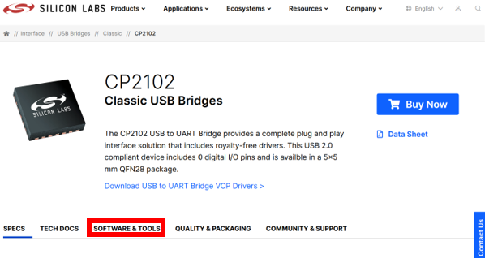
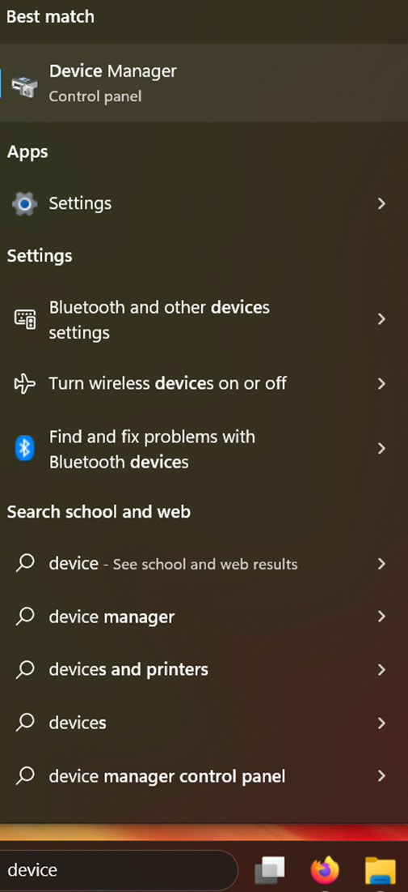
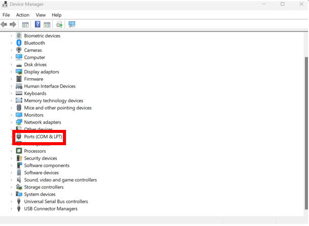

# Driver issues
- So, you’ve got no COM ports showing and you’ve ended up here, with me. No worries, we’ll make an engineering setup out of your laptop yet.
## 1. Go here:
[https://www.silabs.com/interface/usb-bridges/classic/device.cp2102?tab=specs](https://www.silabs.com/interface/usb-bridges/classic/device.cp2102?tab=specs)

## 2. Click here:

## 3. Help yourself to some of this (might have to hit “show more”):

## 4. Once downloaded, unzip this.

## 5. Open `device manager` this can be found by searching in the windows bar:

## 6. Drop down `ports`:

 
- The **COM** port that your **ESP32** is connected to should have a **warning** sign next to it. Clicking this should prompt you to find a driver. Find this manually, navigate to downloads and select the unzipped driver file. It will automatically search this file, and install the drivers.

# Happy coding! 
**(hopefully)**