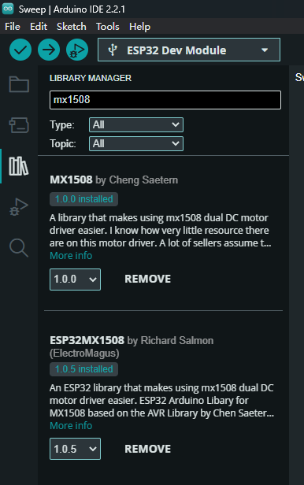
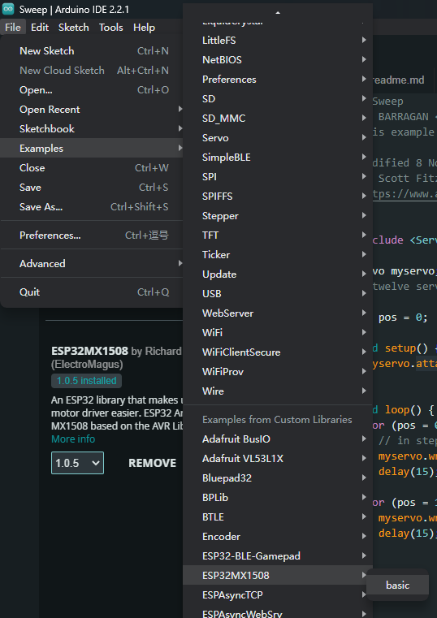

# programming

---
# 0. Intro
**[ESP32 Modules by Espressif](https://www.espressif.com/sites/default/files/documentation/esp32-wroom-32e_esp32-wroom-32ue_datasheet_en.pdf):**
- **Xtensa dual-core 32-bit LX6 microprocessor, up to 240 MHz**
- **4 MB Flash**
- **Wi­Fi**
- **Bluetooth® + Bluetooth LE module**
- **26 GPIOs:** SD card, UART, SPI, SDIO, I2C, LED PWM, Motor PWM, I2S, IR, pulse counter, GPIO, capacitive touch sensor, ADC, DAC, TWAI®

---
# 1. Setup
## 1.1. [Download and install Arduino IDE 2.x, Add ESP32 Boards](./install_Arduino.md)
## 1.2. [Install serial port driver](./driver_issue.md)

---
# 2. Hello word!

## 2.1. Serial port (UART) code


> we can communicate with ESP32 through UART.
* **Code:** Go to `File` > `New Sketch`, and copy the following code:
``` cpp
void setup() { // setup function returns nothing
  Serial.begin(115200); // call Serial class, begin function. BaudRate 115200
}

void loop() { // loop function
  Serial.println("Hi!"); // call Serial class, print line function. Print "Hi!"
  delay(5000); // delay for 5s
}
```
- **In the setup function:**
1. `void setup()` is a special function in Arduino programming that is called once when the microcontroller starts. It's used for initializing things that only need to be done once.
2. `Serial.begin(115200)` is a function call that initializes the serial communication with a baud rate of 115,200. The serial communication is a way for the microcontroller to send and receive data with an external device like a computer.
- **In the loop function:**
1. `void loop()` is another special function in Arduino programming that runs continuously after the setup function. Any code placed in this function will be executed in a loop until the microcontroller is turned off.
2. `Serial.println("Hi!")` is a function call that sends the text "Hi!" to the serial port. This is a way to communicate with a connected computer or other devices via a serial monitor.
3. `delay(5000)` is a function call that pauses the program for 5,000 milliseconds, which is equivalent to 5 seconds. This means that after printing "Hi!" to the serial monitor, the program will wait for 5 seconds before repeating the process.

## 2.2. Uploading the Code
- **Select the board:** Go to Tools > Board > ESP32 > ESP32 Dev Module. 

- Go to `Tools` > `Port` and select the COM port the ESP32 is connected to. (can't find the port? [click here](./driver_issur.md))
- Then, press the `upload` button and wait for the “Done uploading” message.

> If you see a lot of dots (...) on the debugging window and the “Failed to connect to ESP32: Timed out waiting for packet header” message, that means you need to press the ESP32 on-board BOOT button after the dots start appearing.

## 2.3. Now Go to `Tools` > `Serial Monitor` to check the message send form ESP32

---
# 3. What are libraries and how to install them
> Libraries are collections of pre-written code and functions that serve a specific purpose. They are designed to be reused and integrated into your own programs to perform common tasks or add specific functionalities without having to write all the code from scratch.

### [ESP32 Pinout](pinout.md): 


## 3.1. Drive MX1508, Using: [ESP32MX1508@1.0.5](https://github.com/ElectroMagus/ESP32MX1508)

## 3.2. Click on `Library Manger`. Search ESP32MX1508. Click install. (Second one)



## 3.3. Open examples: Go to `Files` > `Examples` > `ESP32MX1508` > `basic`



## 3.4. Connect the Wire, and upload the code. (In the Example: Pin9 and Pin10 are used. They are connected with internal SPI Flash. As a result, please change the pins. [ESP32 Pinout](pinout.md) If you don't know how to connect, click [Drive MX1508](./mx1508.md))

## 3.5. Modify the code. (e.g. Drive 2 motors... feel free to ask for help. )
---

# 4. More about MX1508 and Servos

## 4.1 Move Servos Between 2 Points
> **Servo motor:** A sg90 servo motor is a precise electric motor that uses feedback control to maintain its position. It works by receiving a [PWM](https://en.wikipedia.org/wiki/Pulse-width_modulation) signal, comparing it to its actual position, and making adjustments to minimize any error. This allows it to move to a specific position with high accuracy.
- **Go to `File` > `New Sketch`, and copy the following code:**
```cpp
/*
  The datasheet for these servos recommends 50Hz signal

  Period of waveform:
  1/50 = 20ms

  minimum pulse = 1000us
  max pulse = 2000us
  So max duty cycle is 10%
  Min duty cycle is 5%

  We've picked a 14 bit timer, so 2^14= 16384
  So max signal is 0.1*16384 = 1638
  Min signal is 0.05*16384 = 820

  This gives us ~800 steps- in practice, far more accuracy than the servo can deliver

  However, these servo motor makers just keep on lying to us- the min and max pulses are completely wrong. I don't know why everyone says they're 1-2ms.
  By tweaking the min and max values, you can get a whole 180 degrees out of these. This math will be left to you.
*/

const int frequency = 50;
const int minPulse = 820;
const int maxPulse = 1638;
const int servoPin1 = 27;
const int resolutionPWM = 14;

void writeAngle(int _channel, int _angle){ //Why the underscores? It's just naming convention- you could change the name and it'd work just the same. Here, the underscore means it's a parameter variable
  int angleDuty = map(_angle, 0,180, minPulse, maxPulse); //The map function scales the input variable from the first range to the second
  ledcWrite(_channel, angleDuty);
}

void setup() {
  pinMode(27, OUTPUT);

  ledcSetup(0, frequency, resolutionPWM); //Here, the zero is which timer we want to use- each servo needs a different timer
  ledcAttachPin(servoPin1, 0);
}

void loop() {
  writeAngle(0, 0);
  delay(750);
  writeAngle(0, 180);
  delay(750);
}

void writeAngle(int _channel, int _angle){ //Why the underscores? It's just naming convention- you could change the name and it'd work just the same. Here, the underscore means it's a parameter variable
  int angleDuty = map(_angle, 0,180, minPulse, maxPulse); //The map function scales the input variable from the first range to the second
  ledcWrite(_channel, angleDuty);
}


```
- The code configures an Arduino to control a servo motor with a 50Hz signal. It defines the minimum and maximum pulse width values for the servo, maps them to a 14-bit resolution, and assigns a pin (pin 27) for the servo. In the loop function, it moves the servo from 0 to 180 degrees in steps and pauses for 750 milliseconds between movements. The code uses Pulse Width Modulation (PWM) to control the servo's position by varying the duty cycle of the signal sent to the servo.
- connect the Servo, upload the code.
> For a Servo motor: <span style="color: red;">Red</span> - Vcc(5V), <span style="color: brown;">Brown</span> - GND, <span style="color: orange;">Orange</span> - Signal(PWM)
- Modify the example, Make the Servo Sweep. [Answer](./servo_sweep.md)

## 4.2. Advanced: [Control Servos by a button](./servo_with_interrupts.md)

## 4.3. Advanced: [Drive MX1508 without Lib](./mx1508.md)

## 4.4. Class
```cpp
class Servo{
  const int frequency = 50;
  const int resolution = 14;
  int channel;
  int minPulse;
  int maxPulse;
  int pin;

  public:
  Servo(int _pin, int _minPulseMicros, int _maxPulseMicros, int _channel){
    int periodus = 1000000/50; //1 sec = 1 000 000 micros
    minPulse = float(1<<resolution)*(float(_minPulseMicros)/float(periodus));
    maxPulse = float(1<<resolution)*(float(_maxPulseMicros)/float(periodus));
    pin = _pin;
    channel = _channel;
    ledcSetup(channel, frequency, resolution);
    ledcAttachPin(27, channel);
  }

  Servo(int _pin){
    int periodus = 1000000/50; //1 sec = 1 000 000 micros
    int minPulse = float(1<<resolution)*(float(1000)/float(periodus));
    int maxPulse = float(1<<resolution)*(float(2000)/float(periodus));
    pin = _pin;
  }

  void writeAngle(int _angle){
    int angleDuty = map(_angle, 0,180, minPulse, maxPulse); //The map function scales the input variable from the first range to the second
    ledcWrite(channel, angleDuty);
  }

};

Servo newServo(27, 500, 2500, 0);

void setup() {
  Serial.begin(115200);
}

void loop() {
  newServo.writeAngle(0);
  delay(500);
  newServo.writeAngle(180);
  delay(500);


```
## 4.6. Head files
```cpp
#include "file_name.h"
```
