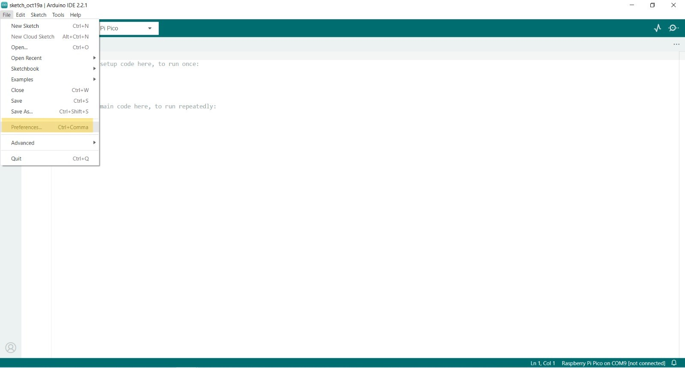
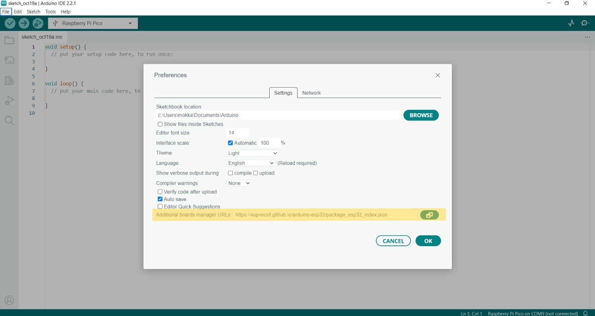
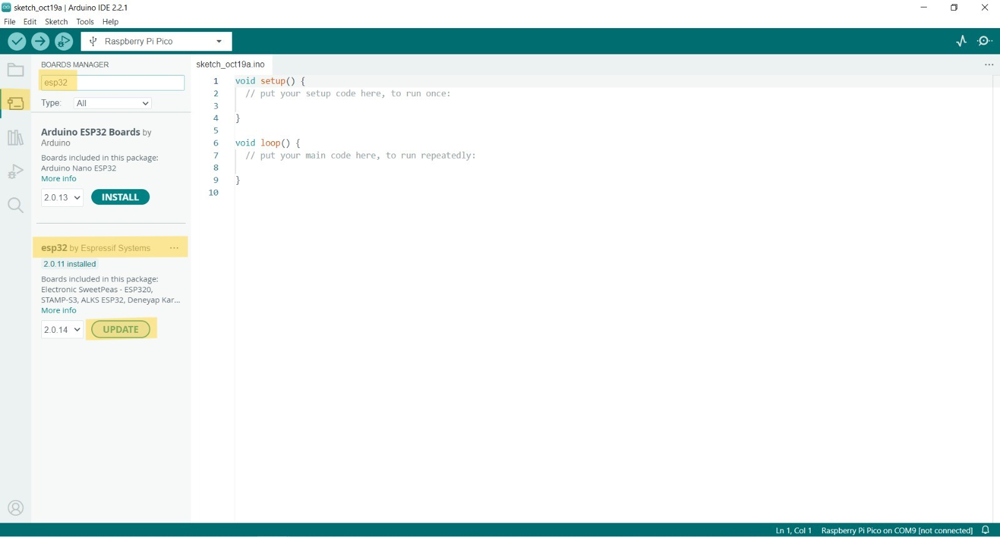

# Installing the ESP32 Board and Arduino IDE

---
# 1. Install Arduino
- There are two versions of the Arduino IDE you can install: Arduino IDE (1) and Arduino 2.0. Arduino 2 is recommended.
- You can download and install Arduino IDE by clicking on the following link: [arduino.cc/en/Main/Software](https://arduino.cc/en/Main/Software)

---
# 2. [Add ESP32 in Arduino IDE](https://espressif-docs.readthedocs-hosted.com/projects/arduino-esp32/en/latest/installing.html)
## 2.1. In your Arduino 2.0, go to `File` > `Preferences`.

## 2.2. Copy and paste the following line to the `Additional Boards Manager URLs`.


> **Stable** release link: 
``` json
https://espressif.github.io/arduino-esp32/package_esp32_index.json
```
> **Development** release link:
``` json
https://espressif.github.io/arduino-esp32/package_esp32_dev_index.json
```

## 2.3. Open the Boards Manager. Click the `Boards Manager` icon in the left-side corner.


## 2.4. Search for `ESP32` and press the install button for `esp32 by Espressif Systems`.
