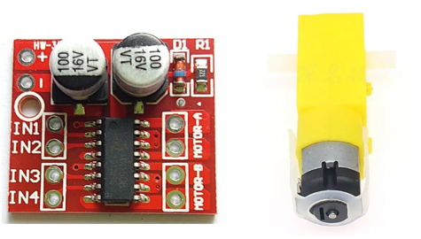
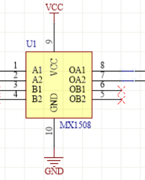

# Drive MX1508

## 1. Physical Image (Model: MX1508)


## 2. Schematic Diagram


| Pin # | Name | Function |
|-------|------|----------|
|   1   |  A1  | 1st channel forward logic input |
|   2   |  A2  | 1st channel reverse logic input |
|   3   |  B1  | 2nd channel forward logic input |
|   4   |  B2  | 2nd channel reverse logic input |
|   5   | OB2  | 2nd channel reverse output |
|   6   | OB1  | 2nd channel forward output |
|   7   | OA2  | 1st channel reverse output |
|   8   | OA1  | 1st channel forward output |
|   9   | VCC  | Power Supply Positive (2-8V) |
|  10   | GND  | Power Supply Ground |

## 3. Introduction
The MX1508 utilizes an H-bridge circuit design and employs high-reliability power MOSFET technology, making it especially suitable for driving coils, motors, and other inductive loads. The internal circuitry integrates N-channel and P-channel power MOSFETs, with an operating voltage range spanning from 2V to 8V. At 27°C with VDD at 6.5V, when both channels are active, the 2nd channel can provide a maximum continuous output current of 0.8A and a maximum peak output current of 1.5A. The 1st channel can provide a maximum continuous output current of 1.5A and a maximum peak output current of 2.5A.

## 4. Logical Truth Table
| INAx | INBx | OUTAx | OUTBx | Function  |
|------|------|-------|-------|-----------|
|   L  |   L  |   Z   |   Z   |  Idle     |
|   H  |   L  |   H   |   L   | Forward   |
|   L  |   H  |   L   |   H   | Backward  |
|   H  |   H  |   L   |   L   | Brake     |

H denotes high voltage, L low voltage and Z means floating- not connected to either
- Idle Mode
In idle mode, INAx=INBx=L. This includes all internal circuits, including driving power MOSFETs, being in a turned-off state. The circuit consumes very low current. At this time, the motor output terminals OUTAx and OUTBx are both in a high impedance state.

- Forward Mode
Forward mode is defined as: INAx=H, INBx=L. In this mode, the motor drive terminal OUTAx outputs a high level, and the motor drive terminal OUTBx outputs a low level. In this state, the motor drive current flows from OUTAx into the motor and from OUTBx to the ground terminal, defining the motor's rotation as forward mode.

- Reverse Mode
Reverse mode is defined as: INAx=L, INBx=H. In this mode, the motor drive terminal OUTBx outputs a high level, and the motor drive terminal OUTAx outputs a low level. In this state, the motor drive current flows from OUTBx into the motor and from OUTAx to the ground terminal, defining the motor's rotation as reverse mode.

- Brake Mode
Brake mode is defined as: INAx=H, INBx=H. In this mode, both motor drive terminals OUTAx and OUTBx output low levels, and the energy stored in the motor will be rapidly released through the NMOS gate at the OUTAx or OUTBx terminal. The motor will stop rotating in a short time. Note that in brake mode, the circuit will consume static power.

## 5. Code
```cpp
#include <Arduino.h>

const int inA1Pin = 13; // Connect to A1 on MX1508
const int inA2Pin = 12; // Connect to A2 on MX1508

uint8_t mode;
uint8_t pulseWidth = 0;
unsigned long lastInterruptTime = 0;
```
>Create constants and global variables- a global variable can be accessed anywhere in the code, which is sometimes useful but can also cause confusing problems and use excessinve memory. However, in a simnple sketch like this it's fine.

```cpp
void IRAM_ATTR handleInterrupt() {
  // This function will be called when the falling edge of GPIO 0 is detected.

  // Record the current time
  unsigned long currentMillis = millis();

  // Check if the interrupt occurred after a debounce delay
  if (currentMillis - lastInterruptTime >= 100) {
    pulseWidth = 0;
    mode ++;
    Serial.print("Mode: "); Serial.println(mode);
  }

  // Update the last interrupt time
  lastInterruptTime = currentMillis;
}
```
This is an interrupt- when a certain condition is met, in this case when the switch pin goes from 5 volts to zero, the ESP32 pauses the main code to run this code. Once this code is complete, it picks back up where it left off. It's really important that this code is as fast as possible, so no complex functions or delays. The tag IRAM_ATTR means this code is in internal RAM- the ESP32 has two main places to store code, internal RAM within the actual microcontroller and SPI RAM in a seperate IC chip outside it. The SPI RAM requires communication between the chips, and is quite slow. If the code gets moved to SPI RAM it will make the interrupt very slow, causing the code to suddenly stop working- the IRAM_ATTR tag stops this from happening.

```cpp
void setup() {
  Serial.begin(115200);

  pinMode(inA1Pin, OUTPUT);
  ledcSetup(0, 500, 8);  // Configure PWM channel 0, 500 Hz, 8-bit resolution
  ledcAttachPin(inA1Pin, 0);  // Attach the PWM channel to the GPIO pin

  pinMode(inA2Pin, OUTPUT);
  ledcSetup(1, 500, 8);
  ledcAttachPin(inA2Pin, 0);

  pinMode(0, INPUT_PULLUP); // Mode selection button connected to GPIO 0
  attachInterrupt(digitalPinToInterrupt(0), handleInterrupt, FALLING);
}
```
 >Here, we set up serial as before, then set up PWM for both motor control pins. Finally, we attach the interrupt as a falling interrupt to pin zero (the boot button on the ESP32).

```cpp
void loop() {
  switch (mode): {
    case 0: { // IDLE
      ledcWrite(0, 0);
      ledcWrite(1, 0);

      break;
    }
    case 1: { // Forward 
      ledcWrite(0, pulseWidth++);
      ledcWrite(1, 0);

      break;
    }

    case 2: { // Backward 
      ledcWrite(1, pulseWidth++);
      ledcWrite(0, 0);

      break;
    }

    case 3: { // Brake
      ledcWrite(1, 255);
      ledcWrite(0, 255);

      break;
    }

    default: {
      mode = 0;

      break;
    }
  }

  delay(20);
}
```
>Here we use a "case select"- the value of "mode" will be taken, then the case that matches it will execute. If mode doesn't match any case, the code underneath "default" will run.
>Setting the value in ledcWrite to 255, the maximum duty, makes the pin go to a constant 3.3v. If both pins are at 3.3v, the motor will engage in braking.

## 6. Drive MX1508, Using library: [ESP32MX1508@1.0.5](https://github.com/ElectroMagus/ESP32MX1508)

### 6.1. Click on `Library Manger`. Search ESP32MX1508. Click install. (Second one)


### 6.2. Open examples: Go to `Files` > `Examples` > `ESP32MX1508` > `basic`


### 6.3. Connect the Wire, and upload the code. (In the Example: Pin9 and Pin10 are used. They are connected with internal SPI Flash. As a result, please change the pins. [ESP32 Pinout](pinout.md) If you don't know how to connect, click [Drive MX1508](./mx1508.md))

### 6.4. Modify the code. (e.g. Drive 2 motors... feel free to ask for help. )
