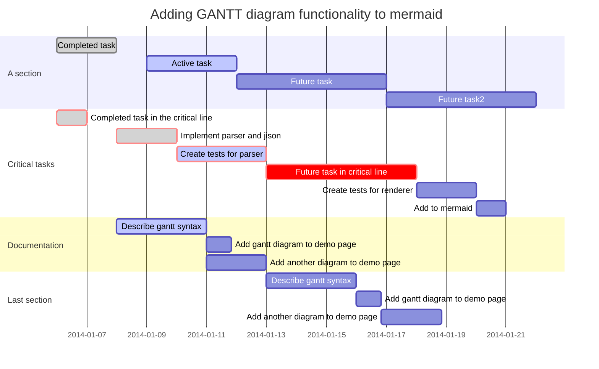

# test - h1
---

## test - h2
---

## Collapsible Set: - h2
<div>
  <button class="collapsible">Open Section 1</button>
  <div class="collapsible_content"> test test test test test test </div>
</div>

<div>
<button class="collapsible">Open Section 2</button>
<div class="collapsible_content"><p>HI HI hi hi HI HI HI HLI HI HI HI </p></div>
</div>

---
# table
---

| Month    | Savings |
| -------- | ------- |
| January  | $250    |
| February | $80     |
| March    | $420    |

---
# code
---

```cpp
// ===========================
// Enter your WiFi credentials
// ===========================
const char* host = "esp32_UBRobotics";
const char* password = "ubrobotics";
const int channel = 9;
```


